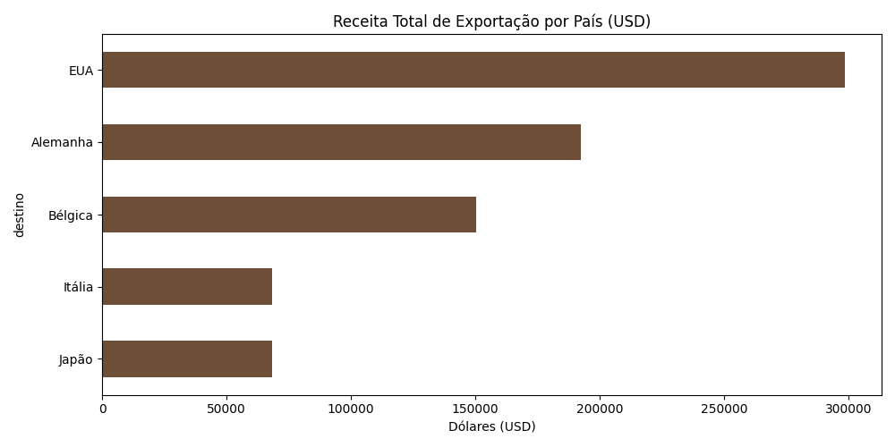
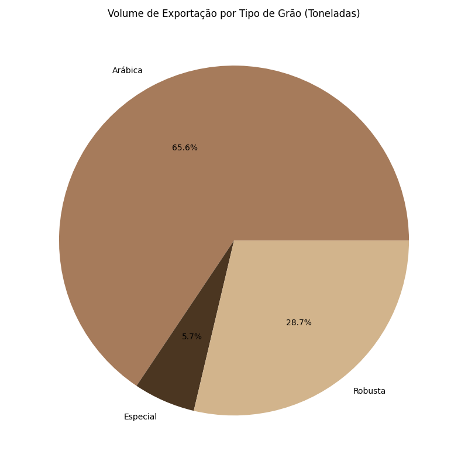

# ☕ Coffee Export ETL Pipeline

Este projeto simula um pipeline de dados completo (ETL) para uma exportadora de café. O sistema extrai dados de logística, aplica transformações financeiras e gera insights automáticos sobre os destinos e volumes exportados.

## 🛠️ Tecnologias Utilizadas
- **Python 3.11**: Linguagem base do projeto.
- **Pandas**: Biblioteca para manipulação e limpeza de dados.
- **SQLite**: Banco de dados para persistência e carga dos dados processados.
- **Matplotlib**: Geração de relatórios visuais (Data Visualization).

## 🔄 Fluxo do Pipeline (ETL)
1. **Extract**: Captura de dados brutos de logística (Destinos, tipos de grãos e toneladas).
2. **Transform**:
   - Cálculo de receita total em USD.
   - Conversão monetária para BRL (Simulação de câmbio).
   - Criação de métricas de performance por categoria.
3. **Load**: Armazenamento dos dados limpos em uma tabela SQL (`tb_export_cafe`) dentro do banco `database_exportacao.db`.

## 📊 Visualizações Geradas
Após a execução, o script gera automaticamente os seguintes relatórios na pasta `/reports`:

### 1. Receita por Destino
Analisa quais países geraram maior faturamento em dólares.


### 2. Volume por Tipo de Grão
Distribuição percentual (Gráfico de Pizza) das toneladas exportadas por categoria de grão.


## 🚀 Como Executar
1. Certifique-se de ter o Python instalado.
2. Instale as bibliotecas necessárias:
   ```bash
   pip install pandas matplotlib